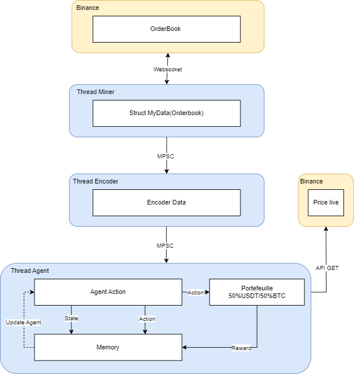

# Guide d'Entraînement pour le Projet de Trading Automatique

## Entraînement de l'Environnement
Pour entraîner l'environnement, utilisez la commande suivante :
```bash 
cargo run --bin train-encoder
```
~10 jours d'entraînements

## Entraînement de l'Agent
Pour entraîner l'agent, exécutez la commande suivante :
```bash 
cargo run --bin train-agent
```
~1 an pour être viable, j'avoue c'est long, j'ai la possibilité d'implémenter des algorithmes de curiosité, de multi-agent, de faire des replay buffers pour entraîner sur des données déjà utilisées et aussi d'utiliser d'autres algos pour les agents comme le 'Soft Actor Critic'.

## Lancement de l'Agent de Trading
Une fois les entraînements complétés, lancez l'agent de trading avec la commande :
```bash 
cargo run
```
## Processus Technique
Le processus actuel du code est le suivant :
1. On récupère les order books du BTC/USDT.
2. On les fait passer dans un encodeur qui intègre des dépendances temporelles.
3. On envoie les données de sortie de l'encodeur qui va être l'environnement de notre agent qui va prendre des actions (acheter, vendre, attendre).

L'agent utilisé actuellement est l'algo PPO (Policy Gradient Optimization) un des meilleurs algo On-policy découvert à ce jour.

## Entraînement dans le Cloud
Pour l'entraînement dans le cloud, le meilleur rapport qualité/prix est AWS G4ad. Si en Spot, mettre souvent des records du modèle dans les S3.

Mais actuellement ayant des capacité assez limité une instance sans gpu pourrais fonctionner

## Framework Burn
Le framework Burn ici utilisé permet d'entraîner nos agents avec n'importe quelle API de GPU (OpenGL, DirectX, Vulkan) grâce à l'utilisation de wgpu qui rend cela possible.

C'est un avantage certain par rapport aux autres frameworks de deep learning classiques qui sont souvent limités à Nvidia en raison de la technologie CUDA, tout en ayant une efficacité relativement égale.

## Architecture du Bot de trading



## Crédit
multi-agent paper: https://arxiv.org/pdf/1706.02275.pdf
SAC paper : https://arxiv.org/pdf/1801.01290.pdf
PPO paper : https://arxiv.org/pdf/1707.06347.pdf
Burn framework : https://burn.dev/


https://www.youtube.com/watch?v=tZTQ6S9PfkE
https://www.youtube.com/watch?v=ioidsRlf79o&t=929s
https://github.com/quantumiracle/Popular-RL-Algorithms/blob/master/sac.py#L326
https://github.com/quantumiracle/Popular-RL-Algorithms/blob/master/ppo_continuous2.py

## Licence
Ce code appartient entièrement à Mathis Keraval et Idir Guettab
Il est interdit de le rendre publique